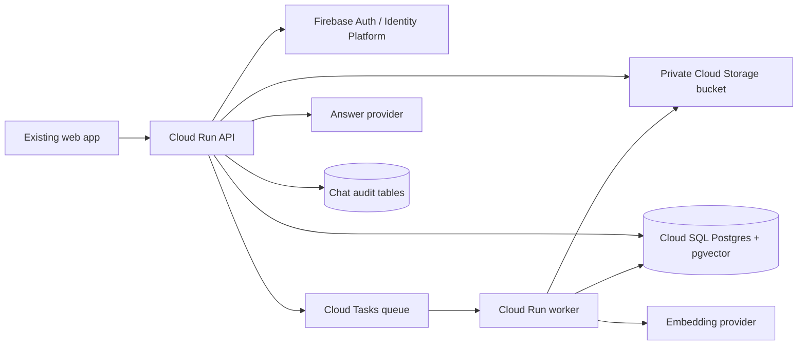

# NSE/BSE Filing RAG Service

Prototype-stage FastAPI microservice for uploading NSE/BSE equity filing PDFs, processing readable text into cited chunks, and answering questions only from uploaded filings.

## Architecture



## Local Setup

```bash
python -m venv .venv
.venv\Scripts\activate
pip install -r requirements.txt
copy .env.example .env
docker compose up --build
alembic upgrade head
```

For local API calls, set `LOCAL_AUTH_ENABLED=true` and send:

```text
x-dev-user-id: user-1
x-dev-organization-id: org-1
```

This mode is ignored in production when `APP_ENV=production`.

## Required Environment

See [.env.example](.env.example). Important values are `DATABASE_URL`, `GCS_BUCKET_NAME`, `FIREBASE_PROJECT_ID`, Cloud Tasks settings, provider selections, model names, and API keys.

## API Examples

Upload:

```bash
curl -X POST http://localhost:8080/api/v1/documents \
  -H "x-dev-user-id: user-1" \
  -H "x-dev-organization-id: org-1" \
  -F company_name="Acme Ltd" \
  -F exchange=NSE \
  -F filing_type=annual \
  -F file=@annual-report.pdf
```

Ask:

```bash
curl -X POST http://localhost:8080/api/v1/chat/answers \
  -H "content-type: application/json" \
  -H "x-dev-user-id: user-1" \
  -H "x-dev-organization-id: org-1" \
  -d '{"question":"What did the filing say about revenue?","top_k":8}'
```

Health:

```bash
curl http://localhost:8080/health
curl http://localhost:8080/ready
```

## Processing

The API stores original PDFs, writes filing metadata, and enqueues Cloud Tasks. The worker downloads the original PDF, extracts digitally readable per-page text with PyMuPDF, chunks page text without crossing page boundaries, embeds chunks, and stores chunk metadata and vectors. OCR and table extraction are not implemented; unreadable scans fail with a clear status.

## Security Assumptions

Firebase JWTs are validated server-side and organization IDs are derived only from validated claims. All document and chunk queries filter by `organization_id`. Buckets are private, Cloud Run services are deployed without unauthenticated access, worker calls are intended to use Cloud Tasks OIDC, and logs avoid raw bearer tokens and full filing contents.

## Prototype Limitations

The ORM stores vectors as JSON for local portability; production can evolve the `document_chunks.embedding` column to native `vector(n)` and use pgvector operators for larger datasets. The current retrieval path is intentionally simple and deterministic for prototype testing. OCR, table extraction, Power BI execution, and investment recommendations are out of scope.

## Power BI Boundary

`POST /api/v1/dashboard/requests` checks organization premium status and stores a queued structured request. A later Power BI MCP integration should consume these rows or replace the service behind `app/services/dashboard.py` without changing the public API.

## GCP Deployment

Provision infrastructure:

```bash
cd infra/terraform
terraform init
terraform apply \
  -var project_id="$PROJECT_ID" \
  -var bucket_name="$BUCKET_NAME" \
  -var api_image="$API_IMAGE" \
  -var worker_image="$WORKER_IMAGE" \
  -var database_password="$DATABASE_PASSWORD"
```

Build and deploy:

```bash
gcloud builds submit --config cloudbuild.yaml --substitutions _REGION=us-central1
```

Run migrations against Cloud SQL from a controlled deploy job or admin workstation:

```bash
alembic upgrade head
```

## Tests And Checks

```bash
ruff check app tests
mypy app
pytest
```
